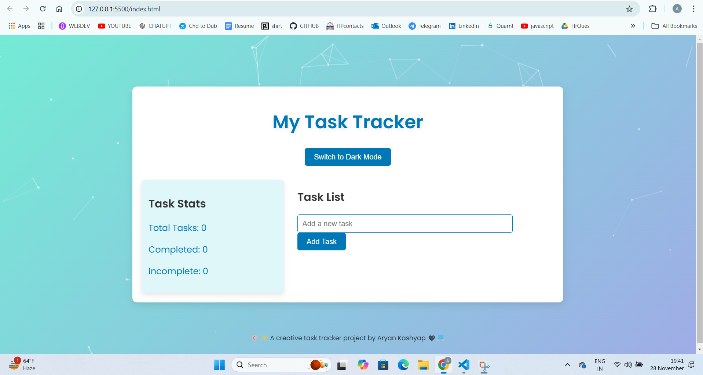
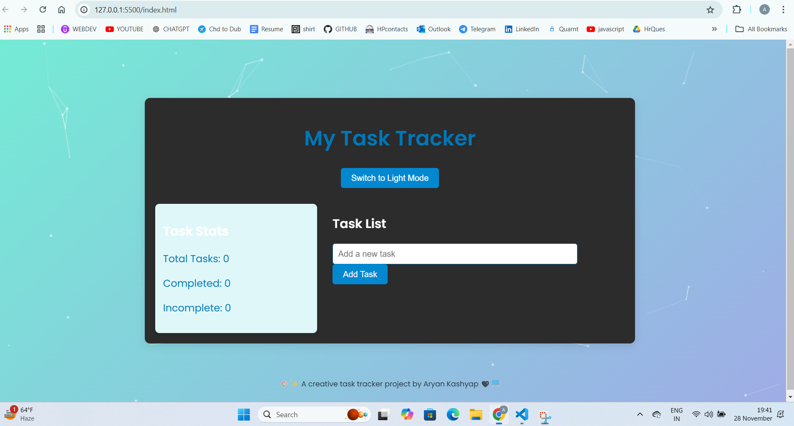
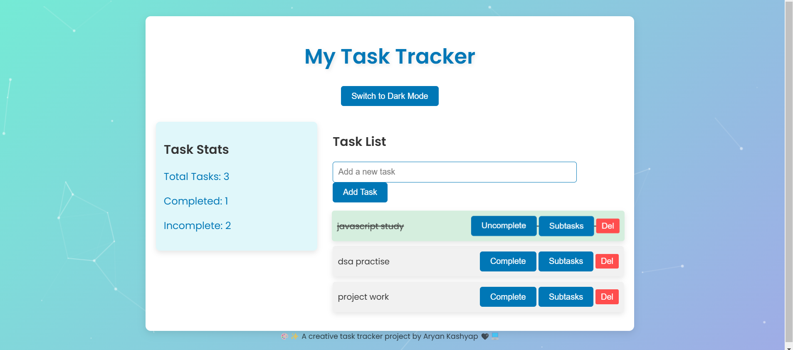

🎨 Dynamic Task Tracker 🗂️
✨ A modern, responsive, and interactive task tracker featuring dynamic slideshows, 3D effects, hover sounds, and seamless design.

📷 Preview
📅 Task Tracker View

### 📷 **Gallery View**

🌟 Key Features 🖱️ 3D Interactive Tilt Effect: Tasks dynamically shift based on mouse movement, adding a 3D effect to each task box.

🎞️ Task Slideshow: Tasks auto-switch when hovered over in each box, allowing users to navigate through multiple task details effortlessly.

🔊 Hover Sounds: Custom audio triggers when you hover over a task box, making the experience more interactive.

🌈 Gradient Background: Aesthetic linear gradient for a beautiful backdrop, making the task tracker visually appealing.

📱 Responsive Design: Fully optimized for desktop, tablet, and mobile devices.

🖼️ Customizable Icons and Visuals: Custom icons for tasks, notifications, and completed statuses.

🛠️ Technologies Used
HTML5: Structuring the content.
CSS3: Styling and animations.
JavaScript (Vanilla): Interactivity and functionality.

🚀 Setup Instructions Follow these steps to set up the project locally:

Clone the Repository:
git clone https://github.com/aryan-ksp/Singer-Gallery.git

Navigate to the Project Directory:
cd Singer-Gallery

Open the Project:
Open gallery.html in your browser to view the project.

How to Add Images
Place your images in the images/ folder.

Customizing Favicon
Replace favicon.ico or favicon.png in the project directory with your custom icon.
Update the <link> in the index.html file if needed:
